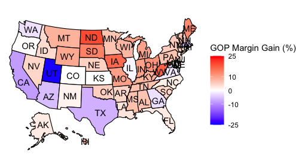
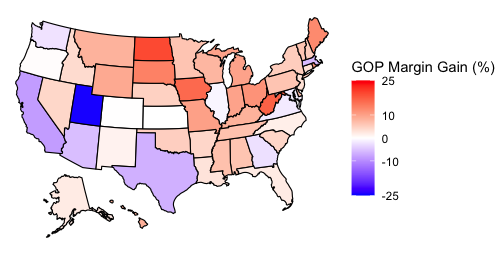
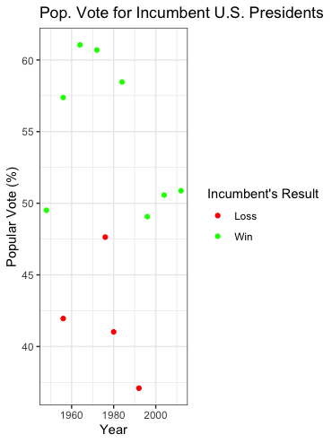

# ElectionBlog
Election Blog Post 1 - Serhiy Sokhan
---

```
```
[Blog Post 9/12/2020](Gov1347/BlogPost1.Rmd)

<b><font size="6">Blog Post 9/12/2020</font></b> 

The United States has an election this fall.  As it is the first presidential election I can vote in, I have been intensely following the campaign and seeking to become more knowledgeable on electoral politics.  I will utilize this blog to make predictions and models throughout and after the election period.  In this first blog post, I investigate the <b>popular vote</b>.  Specifically, I investigate a) the differences in popular vote by state between the 2012 and 2016 presidential elections, and b) how the popular vote relates to incumbency advantage.  

<b><font size="4">Part 1: 2016 vs 2012: What are the differences? </font></b>

First, I wanted to investigate the differences between the two-party popular vote by state between the 2012 and 2016 elections.  I thus created a map that demonstrates the GOP's margin gain between 2012 and 2016.  I did this by subtracting the 2012 GOP margin from the 2016 GOP margin.  Thus, in the maps below, positive percentages are gains for the Republican party and are displayed in red, while negative percentages are gains for the Democratic party and are displayed in blue. Both a labeled and unlabeled map are below.

<b> GOP Margin Gain, 2012-2016 </b>

 

 

This map demonstrates how the popular vote changed on a state-by-state basis and is thus helpful in evaluating President Trump's 2016 win.  One interpretation of the map is that demonstrates how instrumental the Midwest was in Trump's 2016 win.  Michigan, for example, had a 9.84% swing to the Republicans.  Additionally, Wisconsin and Minnesota had 7.74% and 6.22% swings to the GOP, respectively.  On the map, the largest cluster of red is in the Midwest, communicating that Republicans had their highest gains in popular vote margins over the Democrats in that region. 

This map presents potential difficulties for the President's re-election campaign.  The largest clusters of blue are in the South and Southwest, with Democrats growing their two-party popular vote margins by 8.51% in California, 6.59% in Texas, and 5.45% in Arizona.  

The margin changes in the Midwest and Southwest <b>may indicate a shifting electoral map</b>, in which the Rust Belt may shift to being a Republican stronghold, while states with increasing diversity in the South and Southwest may shift to the Democrats.  I plan on furthering my research on electoral map shifts throughout this fall. Using data to predict what was once thought impossible, such as a Republican Minnesota or Democratic Texas, is a salient reason in my taking this Election Analytics course.


<b><font size="4"> Part 2: The Popular Vote and Incumbency Advantage</font></b>

In Part 2, I investigated how <b>incumbency advantage</b> relates to the <b>popular vote</b> between 1948 and 2016. I first filtered my data set to only include elections with an incumbent facing re-election. I then separated the incumbent wins and losses before plotting the data.  

 

This visualization brings up two salient interpretations.  First, incumbents win more often than they lose.  Second, all incumbent presidents that have won since 1948 did so by winning at least 49% of the popular vote, while all incumbent presidents that lost received 47% of the popular vote or less.  These interpretations muddy the waters for President Trump's re-election chances.  On the one hand, he has the incumbent advantage, but on the other, his polling averages are consistently under the 49% earned by all incumbents that won re-election.

<b><font size="4">Conclusion and Sources</font></b>

In conclusion, the visualizations from both parts of the blog make various interpretations arise, some of which indicate good things for President Trump's re-election hopes and some of which indicate bad things.  Above all else, these charts demonstrate that the <b>United States' presidential elections are competitive and difficult to fully predict</b>. As such, I aim to improve my ability to do so and am excited to get into predictions and modeling next week!

To complete this first blog post, I utilized popular vote and popular vote by state data from 1948-2016 from the Gov 1347: Election Analytics course website. As I did not make predictions or model, I did not use literary sources.  

Thank you for reading! You can follow my election modeling journey by checking this blog each Saturday through December.
